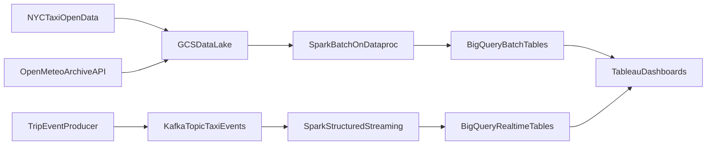

# Wide Project Proposal  
## City Mobility Demand Analytics and Real-Time Monitoring (NYC Taxi + Weather)

### Course
5003 Big Data

### Project Type
Wide Project (Application of Big Data Technologies)

---

## 1. Description of the task to be performed

This project proposes an end-to-end big data system for analyzing urban mobility demand in New York City. The goal is to combine historical analysis and near-real-time monitoring in one architecture and present the results through an interactive dashboard.

The task includes three connected objectives.

First, the project will perform historical demand analysis on taxi trip records. It will identify demand peaks by time, compare demand intensity across pickup zones, and summarize fare and trip-distance patterns. This provides a clear view of when and where mobility demand is concentrated.

Second, the project will integrate weather context into mobility analysis. Weather variables such as temperature and precipitation will be aligned with taxi records by time window to examine how external conditions relate to demand variation.

Third, the project will implement a streaming analytics workflow. Trip events will be continuously ingested and processed in short windows to generate near-real-time indicators such as zone-level trip count, average fare, and average distance. This extends the system from offline analysis to operational monitoring.

Overall, the task is to deliver a complete, deployable analytics pipeline from data ingestion to processing, serving, and visualization, demonstrating practical system integration rather than isolated computation.

---

## 2. Description of the planned datasets

The project uses real public data sources.

### 2.1 NYC Taxi Trip Data
- **Source:** NYC Open Data (Socrata API)  
- **Type:** Structured trip records  
- **Planned fields:** pickup datetime, pickup location ID, fare amount, trip distance  
- **Purpose:** main signal for demand analysis, spatial hotspot analysis, and streaming event generation

### 2.2 NYC Historical Weather Data
- **Source:** Open-Meteo Archive API  
- **Type:** Time-series weather observations  
- **Planned fields:** timestamp, temperature, precipitation  
- **Purpose:** contextual enrichment for interpreting demand changes

### 2.3 Streaming Event Data
- **Source:** event stream generated from real taxi records  
- **Type:** Semi-structured message stream  
- **Planned fields:** event timestamp, pickup zone, fare, distance  
- **Purpose:** near-real-time monitoring and windowed aggregation demonstration

### 2.4 Data integration approach
Taxi and weather datasets will be aligned by time intervals for batch analytics, while streaming events will be aggregated by minute-level windows for live metrics. This design supports both retrospective and real-time analysis in a consistent framework.

---

## 3. Planned technologies to use

The project adopts a layered technology stack, where each technology has a clear role and all components work together in one pipeline.

### 3.1 Apache Spark (Dataproc)
Spark is the core distributed compute engine for:
- batch ETL and aggregation on historical data
- structured streaming for real-time window analytics

### 3.2 Kafka
Kafka serves as the messaging layer for continuous event ingestion and decouples event producers from stream processors.

### 3.3 Cloud Object Storage (GCS)
GCS is used as the data lake layer to store raw taxi/weather inputs and provide stable batch input sources.

### 3.4 BigQuery
BigQuery is the analytical serving layer for storing curated batch outputs and real-time aggregated outputs, and it supports dashboard queries.

### 3.5 Tableau
Tableau is used to build interactive dashboards for trend analysis, spatial demand hotspots, weather impact views, and near-real-time monitoring.

### 3.6 Technology synergy
The architecture integrates storage, messaging, distributed processing, warehouse analytics, and BI visualization into one coherent system, which directly satisfies the wide-project requirement of system breadth and technology collaboration.

---

## 4. System architecture (showing all technologies and their relationships)

The system includes two coordinated paths—batch and streaming—and both paths converge in BigQuery for unified dashboard consumption.

### 4.1 Relationship explanation

- **Data sources -> GCS:** real taxi and weather data are collected and stored in cloud object storage as the raw data layer.  
- **GCS -> Spark batch:** Spark jobs clean, standardize, join, and aggregate historical data.  
- **Batch -> BigQuery:** batch metrics are written to analytical tables.  
- **Producer -> Kafka -> Spark streaming:** trip events are ingested and processed in time windows.  
- **Streaming -> BigQuery:** near-real-time metrics are stored in realtime tables.  
- **BigQuery -> Tableau:** dashboards consume both batch and realtime outputs, forming a unified analysis interface.

### 4.2 Architectural value

This design supports both long-horizon trend analysis and short-latency monitoring in the same platform. It also demonstrates clear role separation and cooperation among all selected technologies, making the project suitable for implementation, demonstration, and final reporting.

---

## Conclusion

This proposal presents a feasible and complete Wide Project: a real-data, cloud-based, batch-plus-streaming analytics system for city mobility demand. It is designed to be practically deployable, analytically meaningful, and well aligned with the requirement to demonstrate the integration of multiple big data technologies in one end-to-end architecture.
